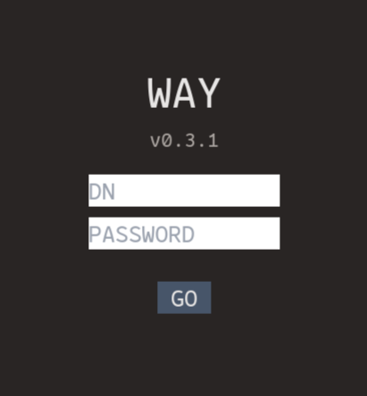

# WAY



Simple auth server & dashboard written in axum & svelte.\
This app works as the bridge between proxy server and LDAP server, using JWT cookie.

## Prerequisites
- proxy server e.g. nginx
- LDAP server e.g. lldap

## Deploy

***Pretend that `way` is hosted in `way.domain.com` and the other apps in `app*.domain.com`.***

1. Prepare `.env`.
   ```
   WAY_DOMAIN=domain.com
   WAY_SECRET_KEY=secret_string
   WAY_NETWORK=ldap://ldap_server_name:3890
   ```

   Optionally you can create `config.yml` and use this app as a simple
   personal dashboard.

   ```
   - name: app1
     url: https://app1.domain.com
   - name: app2
     url: https://app2.domain.com
   ```

2. `sudo docker run -d --env-file /path/to/.env -v /path/to/config.yml:/app/config.yml --network="ldap_server_name" --name way -p 9090:9090 kyoheiudev/way-rs:0.3.0`

3. Set your reverse proxy properly.
   ```
   # e.g. nginx auth_request setting
   # 127.0.0.1:8080 -> backend server
   # 127.0.0.1:9090 -> auth server (way)
   server_name  app.domain.com; # backend server URL

   location / {
       auth_request .auth;
       error_page 500 @auth_failed;
       proxy_pass http://127.0.0.1:8080;
   }

   location .auth {
       internal;
       proxy_pass http://127.0.0.1:9090/api/auth;
       proxy_pass_request_body off;
       proxy_pass_header Set-Cookie;
   }

   location @auth_failed {
       # Add ref param to redirect after logging in
       return 302 https://way.domain.com?ref=$scheme://$http_host$request_uri;
   }
   ```

   ```sh
   # health check
   # ensures env variables are all set and LDAP server can be connected
   curl http://127.0.0.1:9090/health
   ```
